# Monica Tovar - Portfolio Task
[MY PORTFOLIO SITE](https://mmtovarm.github.io/)
## Project Requirements
### Content
- [MY PURPOSE]
The goal of this project is to practice the fundamentals of HTML and CSS I have learned during the SheCodes learning program and showcase it to my mentors for feedback. I will aim for a MVP, starting with a basic wireframe, with full understanding of the process and basic techniques learnt. Was not able to finish but I will continue to work.

## WIREFRAME
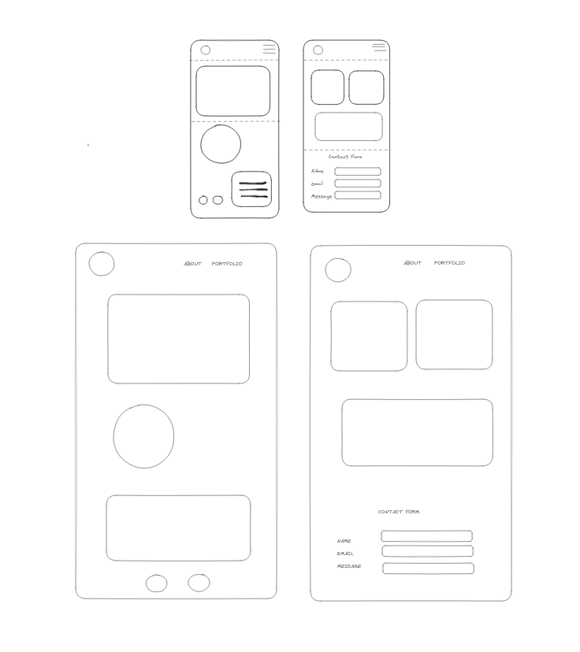

On my first page I have included a profile photo, links to my Github and Linkedin profile and a minibio prompting to enquire more ad link to the second page in which I include a projects section and a functional contact form. I will include the SheCodes first website there as an example.

- [ ] At least one profile picture
- [ ] Biography (at least 100 words)
- [ ] Functional Contact Form
- [ ] "Projects" section
- [ ] Links to external sites, e.g. GitHub and LinkedIn.

### Technical
I will include only two pages for the time being, with my VS code app linked to my github account to commit and push. I will apply the semantic HTML learnings as well as the responsive design principles.
- [ ] At least 2 web pages.
- [ ] Version controlled with Git
- [ ] Deployed on GitHub pages.
- [ ] Implements responsive design principles.
- [ ] Uses semantic HTML.
### Bonus (optional)

- [ ] Different styles for active, hover and focus states.
- [ ] Include JavaScript to add some dynamic elements to your site. (Extra
tricky!)
### Screenshots
#### Landing Page (Home)
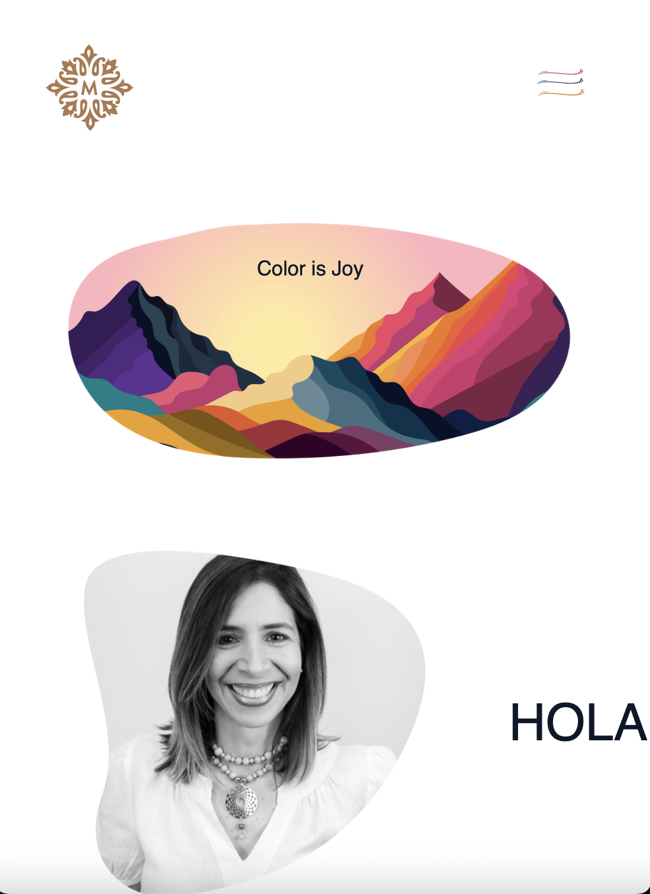
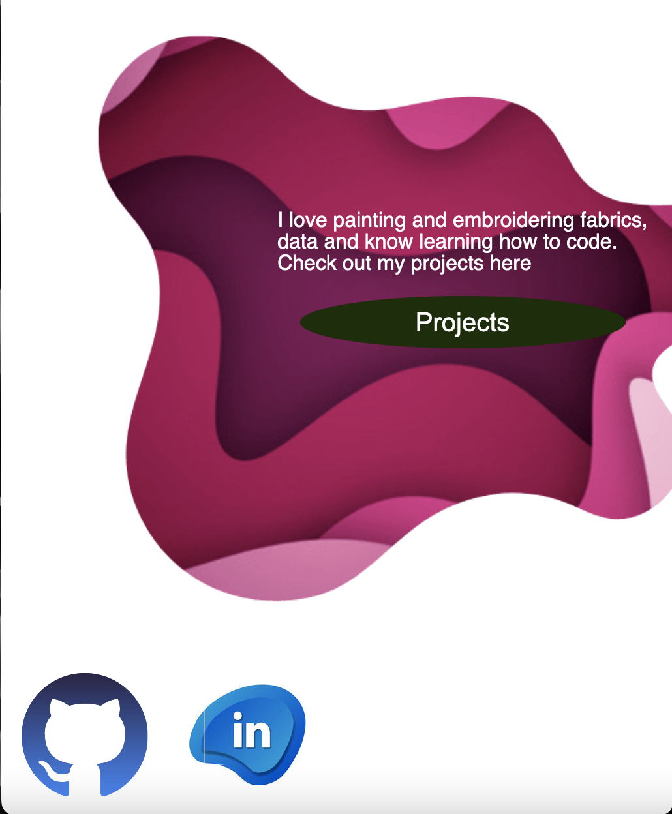
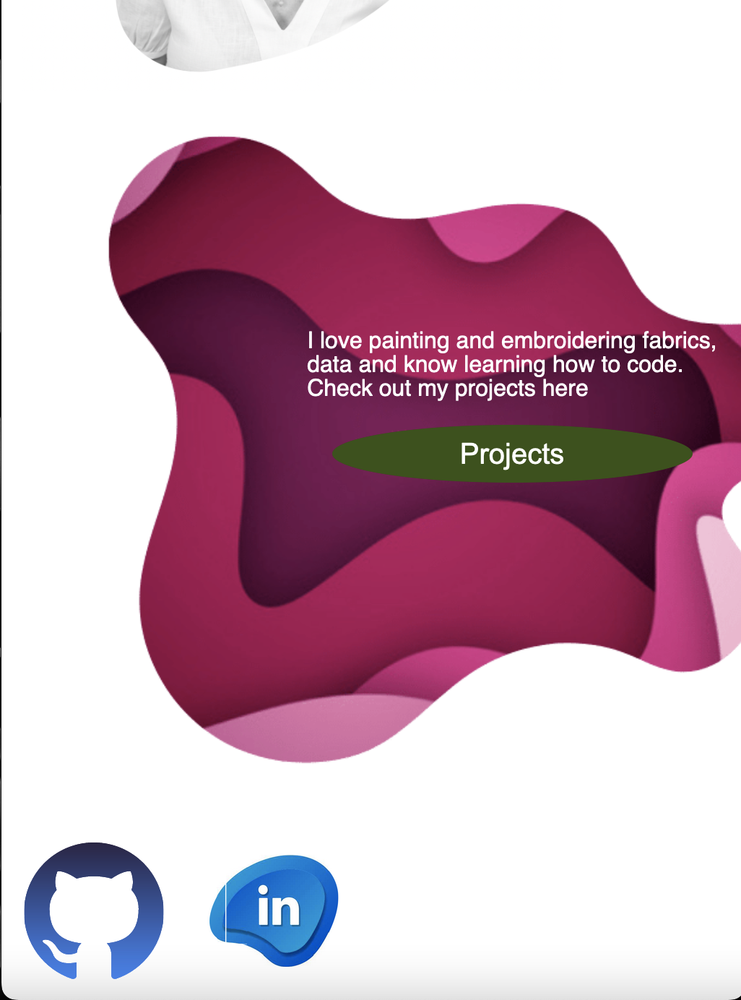
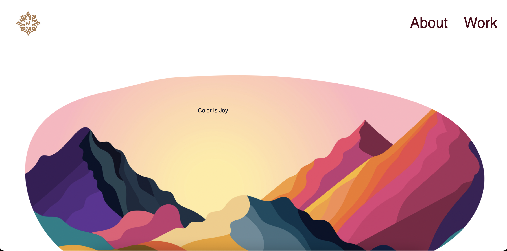

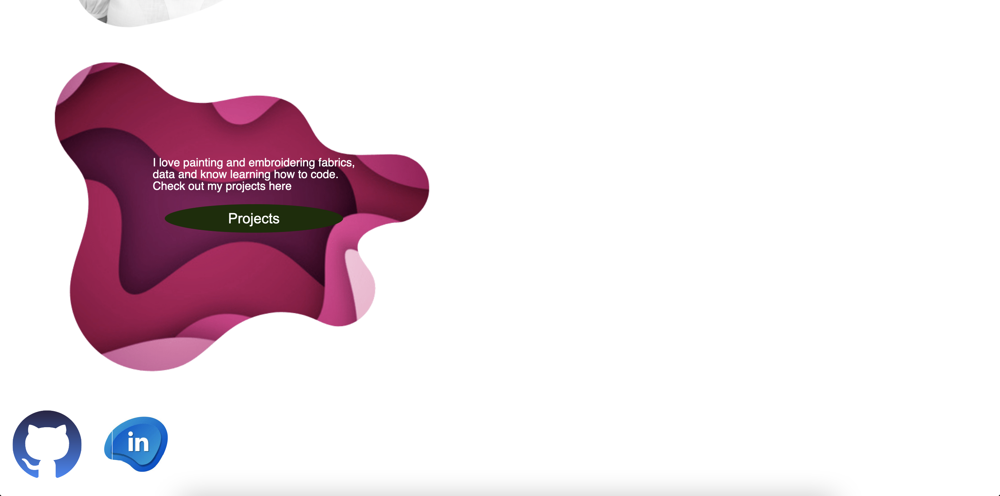
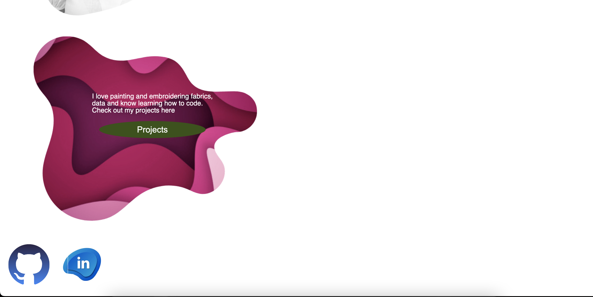
#### Projects Page (Projects/Contact)
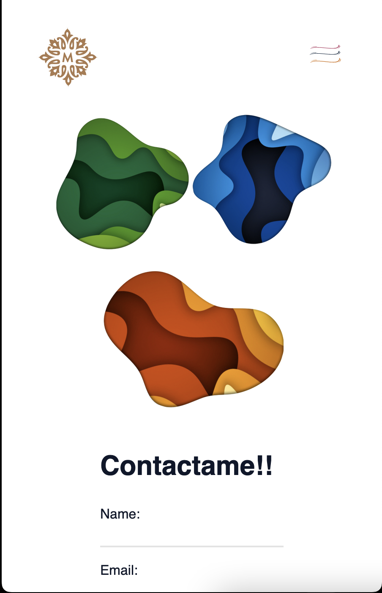
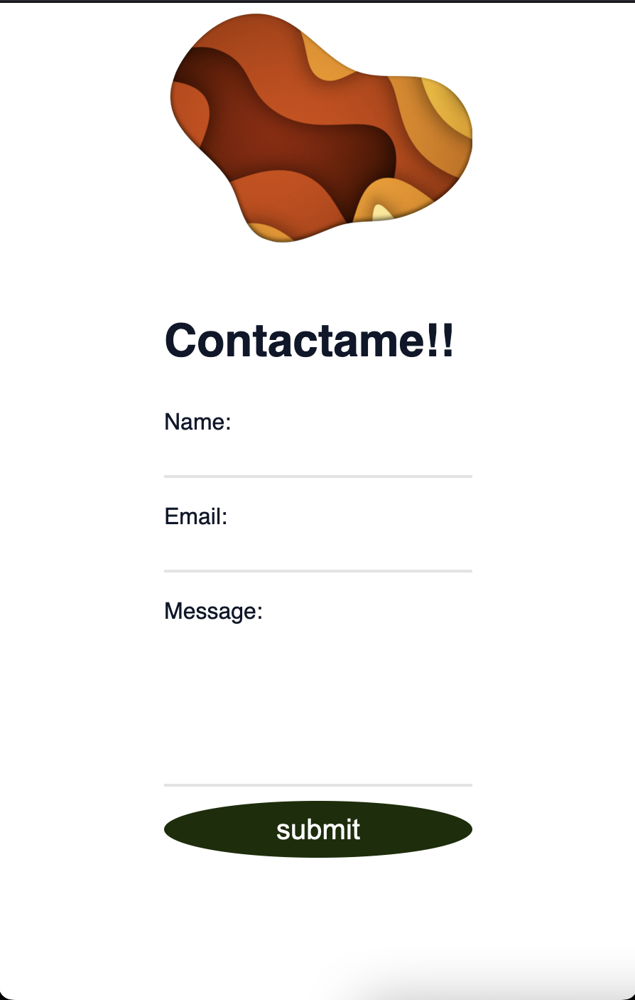
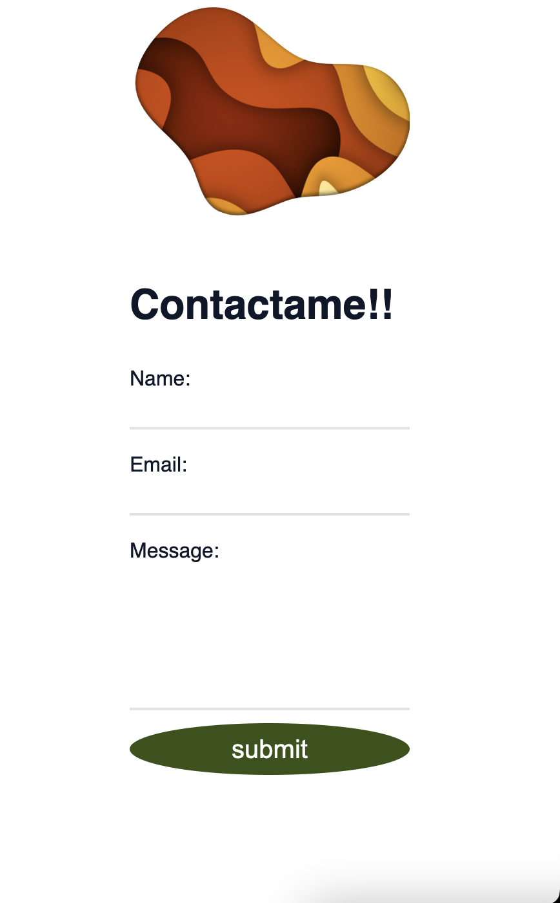
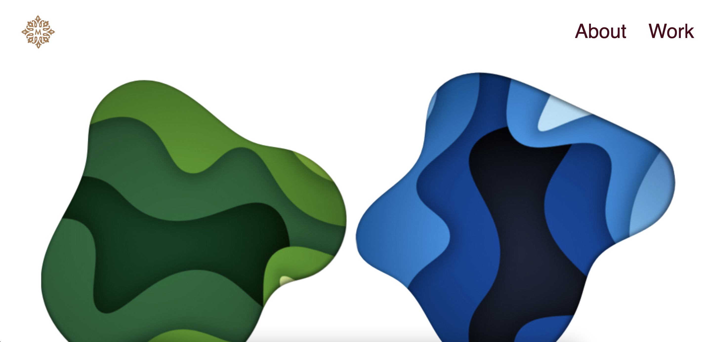
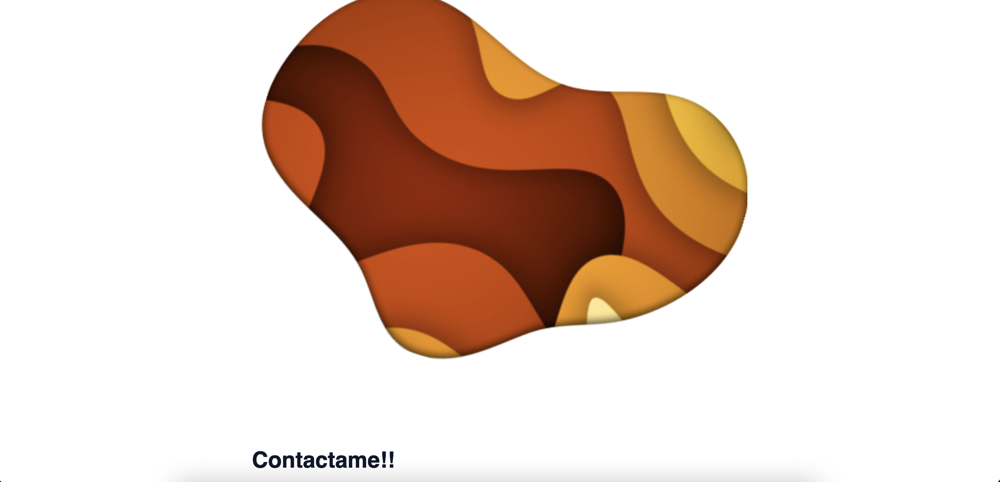
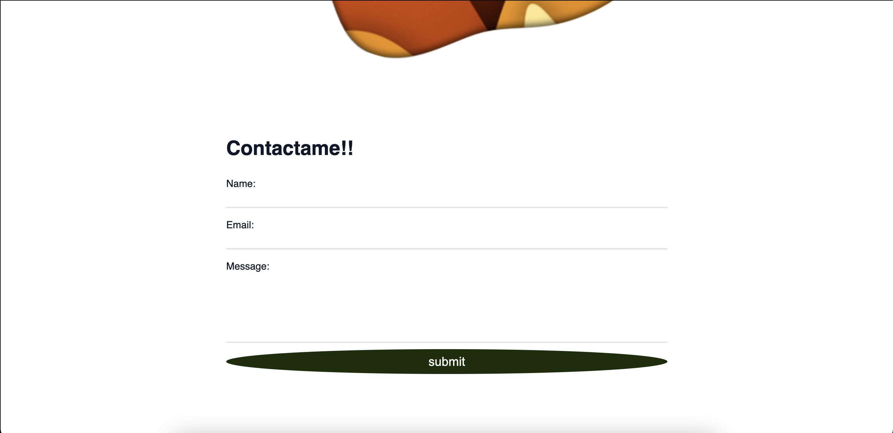